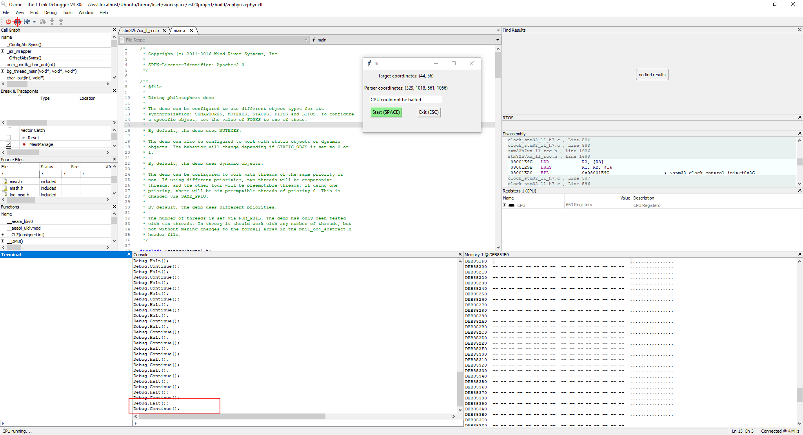

# Ozone Automation Tool

This tool is designed to automate certain actions in the Segger Ozone development environment,
specifically for reproducing a `CPU could not be Halted`-Issue when debugging Zephyr applications.

## Overview

The Ozone Automation Tool is a Python-based utility that employs various threads to streamline interactions with the Segger Ozone Debug Environment. Its primary purpose is to automate the process of starting and stopping the debugging session within Ozone.

### Key Features

- **User Interaction Simulation:** The tool simulates user actions, specifically the process of starting and stopping debugging, by programmatically clicking the Play/Pause button in Ozone.

- **Dynamic Click Positioning:** Users can define the exact position for the simulated mouse clicks by simply clicking once at the desired location. This initial click sets the reference point for subsequent automated interactions.

- **Visual Feedback:** The tool provides visual feedback to users by displaying a target sign at the specified click position. This serves as an indicator, ensuring users are aware of the logged-in coordinates for subsequent interactions.

- **Error Message Monitoring:** Simultaneously, the tool monitors the Ozone screen for specific error messages. It utilizes Tesseract, an optical character recognition tool, to extract text from screenshots of the Ozone screen.

- **Tkinter Visual Representation:** Rectangles are dynamically drawn on a Tkinter window, visually representing the monitored area and providing a real-time display of the tool's activities.

## Requirements

- Python 3.x
- [Tesseract OCR](https://github.com/tesseract-ocr/tesseract)

  **Note:** Ensure Python 3.x is installed on your system. You can install the necessary Python dependencies using the following commands:

  ```bash
  pip install -r requirements.txt
  ```
For the convenience of Windows users, a Tesseract OCR installer is included in this repository.
Simply run the installer for an easy and straightforward installation.
For users on other operating systems, please refer to the [official Tesseract OCR installation guide]((https://tesseract-ocr.github.io/tessdoc/Installation.html)).

Ensure that the installation path of Tesseract OCR is added to the PATH variable to enable the pytesseract module to locate and utilize Tesseract OCR.

## Usage

1. Run `main.py` to open the automation tool window.

2. Click anywhere on the screen to set the target location. This is the position where the automation tool will simulate clicks to start and stop Ozone. Ensure it's directly above the Play/Pause button.

3. Click and drag to generate a rectangle. This rectangle defines the field of view for the script, focusing on monitoring specific areas for the wake word.

4. In the entry field, provide the wake word you want the script to monitor. When this text is recognized, the script will exit, simulating a manual intervention to release Ozone from a stuck state.

5. Start and stop the process of automated clicking using the button in the GUI or by pressing the SPACE key.

As shown in the picture below, the first step is to create a rectangle above the Ozone Console and enter a wakeword to search for. It might work better if you use simple words like "CPU," which should not occur during normal operation. Secondly, before starting, you should set the click marker over the play/pause button in Ozone, as shown in the screenshot. After clicking Space, you should see Ozone continuously start and stop the MCU until the error occurs.



By following these steps, you can effectively use the automation tool to replicate and identify the "Could not hold CPU" error in Segger Ozone.
